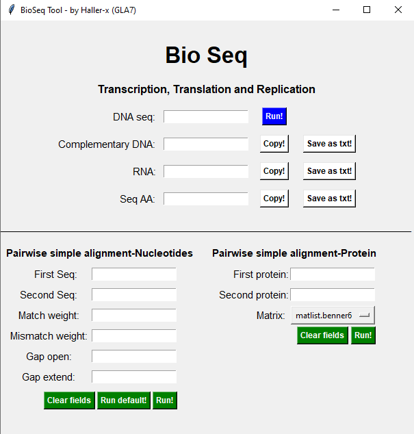

# BioSeq
Bio_seq is a simple application builded utilizing python. There're some features like:
- Complementary dna strand generation
- Rna strand generation
- Amino acid sequence
- Simple DNA pairwise alignment
- Simple matrix protein alignment
- All outputs can be saved as .txt

**<h3>Interface</h3>**

